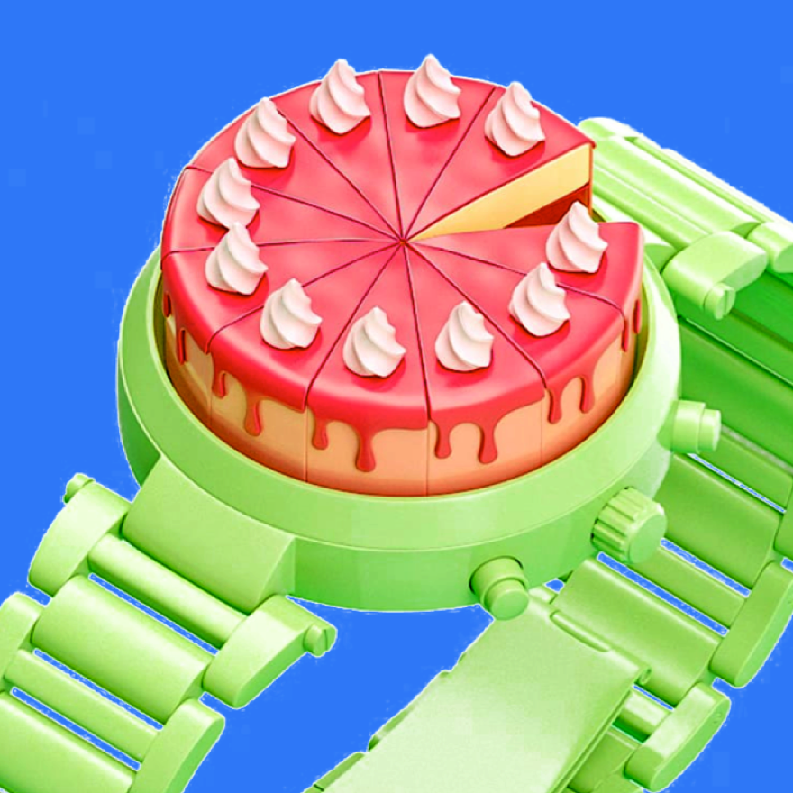
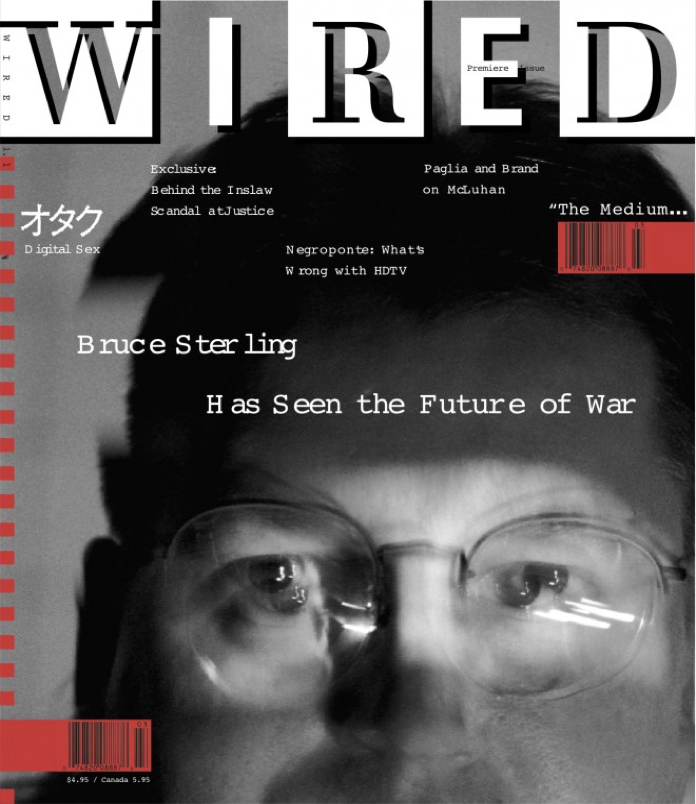

[section name="howToUse"]
Zwei übereinander schwebende Bilder können über den Shortcode `[raw][float-image][/raw]` eingefügt werden, die zwei Bildtags umschließen.
```markdown
[raw]
[float-image]


[/float-image]
[/raw]
```

Dieser Shortcode rendert dann das folgende Template
```twig
<div class="ad-o-container">
  <div class="ad-m-float-image col-full">
    
    <div class="ad-a-img ad-a-img-static">
      <amp-img src="{{ staticImage.src }}" layout="responsive" width="{{staticImage.width}}" height="{{staticImage.width}}" alt="{{ staticImage.alt}}"></amp-img>
    </div>

    
    <div class="ad-a-img ad-a-img-shadow-static ad-a-img-parallax">
      
      <amp-img src="{{ parallaxImage.src }}" layout="fill" width="{{parallaxImage.width}}" height="{{parallaxImage.width}}" alt="{{ parallaxImage.alt}}" amp-fx="parallax"
		  data-parallax-factor="1.1"></amp-img>
    </div>
  </div>
</div>
```
[/section]

[section name="demo"]
Der Shortcode `[raw][float-image][/raw]` sieht auf der Seite eingebunden dann so aus
[float-image]


[/float-image]


Die Bilder innerhalb eines `[raw][float-image][/raw]` Shortcodes können außerdem über GET-Parameter manipuliert werden, wie in der Grav CMS [Dokumentation](https://learn.getgrav.org/content/media) beschrieben. Zum Beispiel durch das Anhängen von `?gaussianBlur=5`
[float-image]


[/float-image]
[/section]
